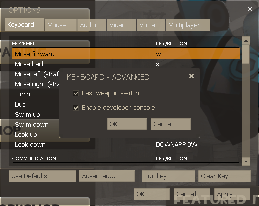

# TF2 Miscellania
{: .no_toc }
This section is intended to help answer common questions regarding customizing, playing, and common issues you may encounter in TF2.
{: .fs-5 .fw-300 }

## Table of contents
{: .no_toc .text-delta }

1. TOC
{:toc}

## Console
<small>*“How do I open my console?”*</small>

To open the in-game console, press the `~` (tilde) key on your keyboard at any time while in-game. Its location may vary depending on the keyboard, but for the vast majority of keyboards, it is directly to the left of the number `1` key.

If the console does not immediately open, you may have to first enable it. There are two ways to do this:
1. Launch the game with the [`-console` option](#launch-options).
2. In TF2, open Settings, and go to the **Keyboard → Advanced** section, and check `Enable developer console`.

## Launch options
<small>*“How do I set launch options?”*</small>

If you need (or want) to specify special launch options for TF2 that apply when the game opens, follow these simple steps:
1. Go to your Steam Library.
2. Right-click on "Team Fortress 2".
3. Click on "Properties".
4. On the bottom of the "General" tab, enter your launch options there.

Some useful launch options:
- `-novid`: Skips the Valve intro video, going straight to the main menu.
- `-nojoy`: Disables joystick/gamepad detection. Can improve load times if you are not planning on playing with a controller.
- `-w xxx -h yyy`: Forces the game resolution width to `xxx` and height to `yyy`.
- `-windowed`: Forces the game to run in a window instead of fullscreen.
- `-fullscreen`: Forces the game to run in fullscreen instead of a window.
- `-noborder`: When used with `-windowed`, removes the title border on the game window. This can be used to run the game in "borderless fullscreen" with the correct resolution.